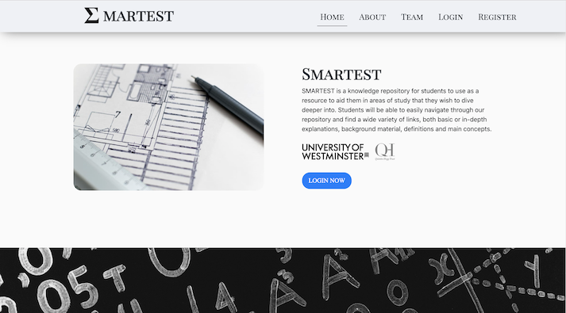

### Hi, I'm David and I am currently working as a research associate at the University of Westminster!

Recently, I've worked as part of a small software development team to develop [SMARTEST](https://smartestknowledge.org/), an online learning tool and cool project at the University of Westminster!

 

 

Working on SMARTEST has allowed me to develop not only coding skills in HTML, CSS and JavaScript, but also in working with Neo4j as part of other research projects, and working with MongoDB and Heroku with a Node.js/Express backend. Previously, during my time as a university student, I had also gained experience in Java, C#, MySQL and Swift and had the interesting experience of learning Objective-C (a very cool language!) shortly after graduating.

  
A more detailed record of my career as a software developer can be found on [LinkedIn](https://www.linkedin.com/in/david-chan-you-fee-2533b3148/)!

<!--
**davidchan125/davidchan125** is a ✨ _special_ ✨ repository because its `README.md` (this file) appears on your GitHub profile.

Here are some ideas to get you started:

- 🔭 I’m currently working on ...
- 🌱 I’m currently learning ...
- 👯 I’m looking to collaborate on ...
- 🤔 I’m looking for help with ...
- 💬 Ask me about ...
- 📫 How to reach me: ...
- 😄 Pronouns: ...
- ⚡ Fun fact: ...
-->
