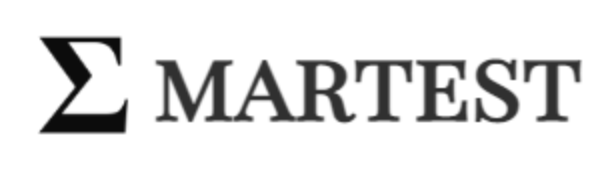

Hi, I'm David, a research associate at the University of Westminster!

The most recent accessible project I have contributed to is called ΣMARTEST (pronounced _sum-artest_), which is accessible [here](https://smartestknowledge.org/). If you are interested in trying out graph-based learning, please sign up as a student and try it out. We really appreciate feedback!

Working on SMARTEST has allowed me to develop my web development experience with:
- HTML, CSS and JavaScript
- MongoDB
- MySQL
- Heroku
- Node.js and Express
- the [vis.js](https://visjs.github.io/vis-network/examples/) library (very cool)!

I also had the opportunity to work with the Neo4j graph database as part of other research projects running in parallel to SMARTEST.

My time at university gave me a language skillset in Java, C#, MySQL and Swift, and after graduation I expanded this with Objective-C, as part of an iOS development role.

  
I can be found on LinkedIn [here](https://www.linkedin.com/in/david-chan-you-fee-2533b3148/)!

<!--
**davidchan125/davidchan125** is a ✨ _special_ ✨ repository because its `README.md` (this file) appears on your GitHub profile.

Here are some ideas to get you started:

- 🔭 I’m currently working on ...
- 🌱 I’m currently learning ...
- 👯 I’m looking to collaborate on ...
- 🤔 I’m looking for help with ...
- 💬 Ask me about ...
- 📫 How to reach me: ...
- 😄 Pronouns: ...
- ⚡ Fun fact: ...
-->
